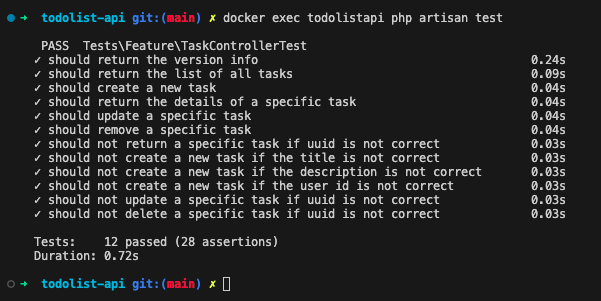
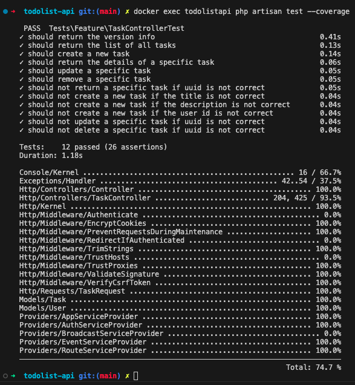

# John Task List
RESTful API for a task management application (to-do list).

## Base URL to production
* `https://todolist-api-luaramineiro.vercel.app/api`
* Video of the api running is uploaded [here](public/video-2023-08-28.mov)

## System requirements to run locally
* Install [PHP](https://www.php.net/manual/en/install.php) `^8.1`
* Install [Composer](https://getcomposer.org)
* Install [Docker](https://docs.docker.com/engine/install/)

## How to run the project locally for the first time?
1. Install all the dependencies of project running `composer install`
2. Run `docker compose up -d db` to create the Postgres database image
3. Run `docker compose up --build todolistapi` to create the application container
4. Run `docker exec todolistapi php artisan migrate` to run the migrations inside the docker application container
5. You can check the endpoints available in [Swagger Documentation](#swagger-documentation)

## Useful commands

### Docker
* Command to create and run containers in the background: `docker compose up -d db`
* Command to build images before starting containers: `docker compose up --build todolistapi`
* Command the stops containers and removes containers, networks, volumes, and images created by `up`: `docker compose down -v`
* Command to run the migrations: `docker exec todolistapi php artisan migrate`

> :warning: The [Laravel Sail](https://laravel.com/docs/10.x/sail#interacting-with-sail-databases) it is not being used because it does not support `Postgresql` and as an architecture decision this is the database that the project uses.

### Swagger Documentation
* PHP swagger annotation and parsing library used: [L5-Swagger](https://github.com/DarkaOnLine/L5-Swagger)
* Command to (re)build the documentation: `docker exec todolistapi php artisan l5-swagger:generate`
* [OpenAPI Specification](https://github.com/OAI/OpenAPI-Specification/blob/main/versions/3.0.3.md)
* Link to access locally: `http://localhost:8000/api/docs`

### Tests
* Run the tests: `docker exec todolistapi php artisan test`

* Check the test coverage: `docker exec todolistapi php artisan test --coverage`

## Requirements specifications

>:warning: It was not clear from the specification which field should be a required field, size or type to model a database and code the validations to be returned to users based on requirements.

## TO-DO
- [ ] Create an user authentication to do not need pass the `user_id` as a parameter at `POST` endpoint
- [ ] Write the `swagger` documentation in less lines
- [ ] Write a test case to coverage the `attachment` field is null
- [ ] Write a test case to coverage the `Exceptions/Handler::class`